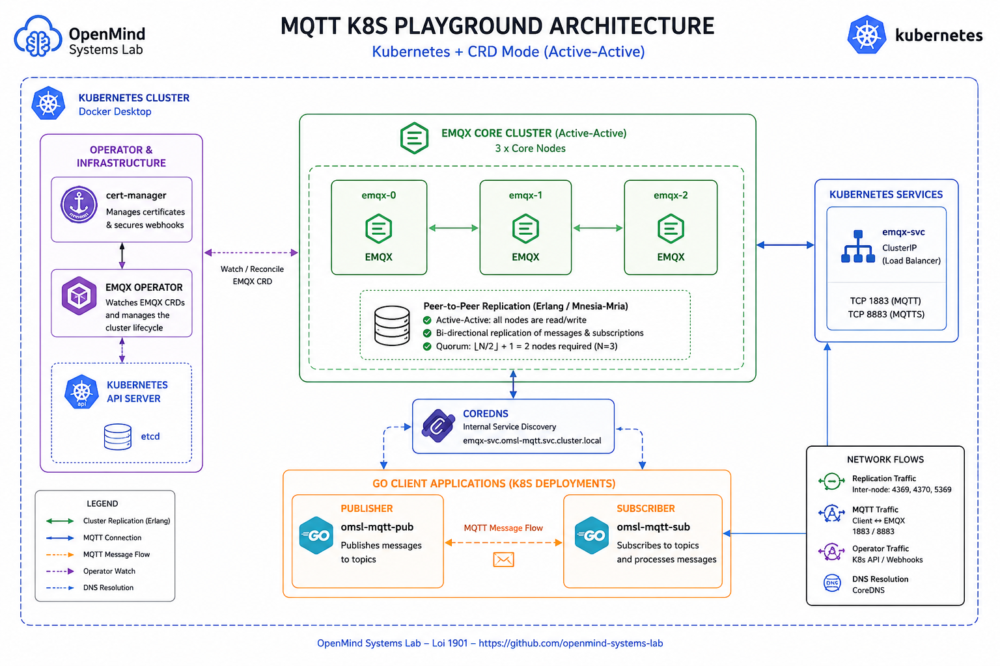

<p align="center">
  
</p>

<h1 align="center">MQTT K8S Playground (Kubernetes + CRD Mode)</h1>

<p align="center">
A pedagogical Proof of Concept (PoC) demonstrating a highly available (HA) distributed MQTT workflow inside Kubernetes (Docker Desktop). It deploys an EMQX v5 Core Cluster along with a compiled Go application acting as both publisher and subscriber to validate seamless failover.</p>

<p align="center">


</p>

## 📖 Overview
This repository provides a self-contained blueprint to test distributed MQTT structures entirely inside a local Kubernetes environment. It avoids Docker Compose entirely by packaging the Go client inside a Kubernetes deployment that interacts with an operator-managed, multi-node EMQX Core cluster utilizing an Active-Active replication model.

## 🎯 Lab Goals
☁️ Master MQTT in Kubernetes: Learn how to deploy and manage a high-availability EMQX Core cluster natively within a K8s environment, bypassing Docker Compose.

* Operator-Driven Lifecycle: Understand how the EMQX Operator automates cluster provisioning, upgrades, and networking.

* Validate HA Mechanics: Observe the Active-Active replication model and ensure messages persist despite node failures.

* Network Routing & Discovery: Validate how internal CoreDNS resolution allows publishers and subscribers to locate cluster nodes dynamically.

* Chaos Resilience: Verify that the MQTT data loop survives targeted pod termination (Chaos Engineering) via automatic failover and quorum maintenance.

## 🧩 Components
* **cert-manager**: Intercepts and secures internal validation webhooks.
* **EMQX Operator**: Provisions and configures the EMQX deployment lifecycle.
* **Go Client Application**: Divided into separate publisher and subscriber clients to validate load balancing and network routes using standard internal CoreDNS resolution.

## 🏗 Architecture & HA Mechanics
Unlike traditional architectures, EMQX v5 forms a **Peer-to-Peer (Active-Active)** topology among its Core nodes using Erlang's distributed database (*Mnesia/Mria*). 
* **No Master/Slave:** All 3 deployed pods(`emqx-0`, `emqx-1`, `emqx-2`) have identical write/read privileges.
* **Bi-directional Replication:** Subscriptions and messages are replicated instantly between pairs across the internal cluster network.
* **Quorum Rule:** A cluster of $N=3$ nodes requires a strict majority of living nodes to remain functional and avoid split-brain scenarios.

Cleanup
To tear down the playground environment:
kubectl delete -f manifests/
helm uninstall emqx-operator -n emqx-operator-system
helm uninstall cert-manager -n cert-manager


## 📋 Prerequisites
* 🐳 Docker Desktop with Kubernetes enabled

* 🛠 kubectl and helm v3+

* 🐹 Go 1.23+

## 📥 Installation
Clone the repository and enter the directory:
```bash
git clone https://github.com/openmind-systems-lab/mqtt&k8s-playground.git
cd mqtt&k8s-playground
```

## ⚡ Quick Start / Deployment

### Step 1: Bootstrap the Operator Infrastructure
1. Add the required Helm chart repositories:
```bash
helm repo add jetstack https://charts.jetstack.io
helm repo add emqx https://repos.emqx.io/charts
helm repo update
```

2. Install `cert-manager0:
```bash
helm upgrade --install cert-manager jetstack/cert-manager \
   --namespace cert-manager \
   --create-namespace \
   --set crds.enabled=true \
   --wait
```

3. Install the `emqx-operator`:
```bash
helm upgrade --install emqx-operator emqx/emqx-operator \
   --namespace emqx-operator-system \
   --create-namespace \
   --wait
```

### Step 2: Provision EMQX and the Client App
1. Build and load the Go application into Docker Desktop's Kubernetes image registry:

```bash
go mod tidy
docker build -t openmind-systems-lab/mqtt-client:local .
```

Apply all Kubernetes manifests (EMQX instance, services, namespace, and the Go application client):

```bash
kubectl apply -f manifests/
```
---

## 🔍 Verification & Topology Inspection
1. Watch the deployment status until all 3 EMQX core pods and the client apps are running:

```bash
kubectl get pods -n omsl-mqtt -w
```

2. **Verify Cluster Health & Cohesion:**
Ensure that all 3 nodes have successfully discovered each other and joined the same mesh network:
```bash
kubectl exec -it emqx-0 -n omsl-mqtt -- emqx ctl cluster status
```

*Expected output: All 3 pods listed inside the `running_nodes` block.*

3. **Locate Client Connections:**
Because the Kubernetes `Service` acts as a Load Balancer, your publisher and subscriber will be balanced onto different nodes. 
Check where they landed:
```bash
kubectl exec -it emqx-0 -n omsl-mqtt -- emqx ctl clients list
kubectl exec -it emqx-1 -n omsl-mqtt -- emqx ctl clients list
kubectl exec -it emqx-2 -n omsl-mqtt -- emqx ctl clients list
```

4. **Chaos Engineering: The Cluster Pod Crash Test 💥**
To prove the resiliency of this Active-Active cluster setup:

Stream Logs:
```bash
kubectl logs -f deployment/omsl-mqtt-sub -n omsl-mqtt
```

Sabotage Node emqx-0:
```bash
kubectl delete pod emqx-0 -n omsl-mqtt --grace-period=0 --force
```

Observe Failover:
The remaining nodes (emqx-1 and emqx-2) maintain the Quorum. The streaming logs on your Go client keep rolling without a single interruption. Kubernetes will instantly provision a new emqx-0 pod which automatically rejoins the cluster.

## 🧹 Cleanup
To tear down the playground environment:

```bash
kubectl delete -f manifests/
helm uninstall emqx-operator -n emqx-operator-system
helm uninstall cert-manager -n cert-manager
```

## 🧭 Conclusion

This project successfully demonstrates how to orchestrate a complete MQTT workflow within a local Kubernetes environment. By moving from a traditional approach (Docker Compose) to a native, operator-based management system, you benefit from increased resilience, simplified scalability, and seamless integration with Cloud Native standards. This PoC provides a solid foundation for testing fault tolerance and high availability in your IoT applications before moving to production.


## 🏛 About OpenMind Systems Lab

OpenMind Systems Lab is an independent French non-profit association dedicated to research, experimental development and technical benchmarking in Cloud Native technologies.

Our mission is to produce practical, reproducible and educational Open Source Proofs of Concept covering Kubernetes, Platform Engineering, Distributed Messaging, Infrastructure Security and Artificial Intelligence.

GitHub Organization:

https://github.com/openmind-systems-lab


---

<p align="center">
Made with ❤️ by OpenMind Systems Lab
</p>
